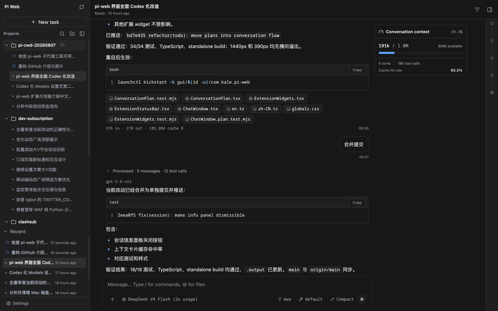
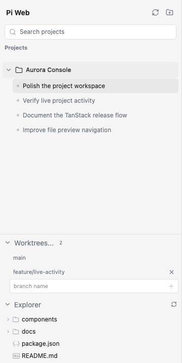
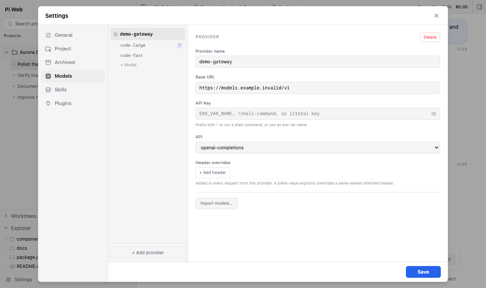

# Pi Web

[English](./README.md) | [日本語](./README.ja.md) | [Русский](./README.ru.md)

[pi 编程智能体](https://github.com/earendil-works/pi)的本地浏览器工作区。Pi Web 把项目、会话、智能体活动、worktree 和文件放在同一个界面中，同时与 pi 共用本机配置和 JSONL 会话文件。

```bash
npx @agegr/pi-web@latest
```

要求 Node.js 22.19.0 或更高版本。服务就绪后 Pi Web 会自动打开浏览器，默认仅监听 `127.0.0.1`。

中文微信群：请查看 [GitHub Discussions 帖子](https://github.com/agegr/pi-web/discussions/271)。



## 一个界面管理 Pi 工作流

- **项目与会话**：项目常驻可见，支持搜索、排序和归档；可以查找、继续、重命名、导出或删除会话，并继续使用与 pi 兼容的目录和 JSONL 存储。
- **实时智能体活动**：查看哪些项目正在运行，跟踪流式 thinking 与工具调用，并在非当前项目中的任务完成时收到反馈。
- **会话关系**：清楚区分主会话、fork 会话和 subagent 会话；既可从较早消息创建独立会话，也可在当前会话内建立分支。
- **对话旁的项目文件**：从消息中打开链接文件并查看 Git Diff，可预览源码、Markdown、图片、音频、PDF 和 DOCX；文件变化后自动刷新。
- **Git worktree**：从侧边栏创建、切换和移除 linked checkout，同一仓库的会话仍保持在一个项目中。
- **紧凑但完整的控制**：查看上下文和花费，选择模型、推理级别和工具预设，压缩上下文，切换会话分支，并从 Markdown 直接打开本地文件。



## 在浏览器中完成配置

Pi Web 与 pi 共用本地设置和凭据存储。保存模型和 Provider 改动后，正在运行的会话也会刷新配置，无需重启工作区。设置中心统一提供：

- 模型 Provider、OAuth 登录、API Key、自定义端点、模型发现和模型测试；
- 全局与项目技能的搜索、安装和更新；
- 插件包管理及项目扩展重新加载；
- 外观、语言、完成提示音、项目信任和归档项目管理。

凭据保留在 pi 的本地存储中。本 README 的截图使用合成 Provider 数据，不包含任何凭据内容。



## 当前技术基础

当前仓库使用 **TanStack Start**、**TanStack Router**、**Vite** 和 **Nitro**，生成 Node server 输出。迁移在保留应用行为的同时，替换了之前的 Next.js 运行时。

```text
浏览器 / PWA
    ↓ TanStack Router + 流式 SSE
TanStack Start 路由与全局中间件
    ↓ 薄适配器
框架中立的 app/api handler（Request / Response）
    ↓
Pi 会话、模型、工具、文件、Git 与 worktree
```

- **框架中立的 API 核心**：41 个 API handler 使用标准 Web `Request` 和 `Response`。TanStack server route 保持轻薄，共享方法守卫保留明确的 `405` 行为。
- **流式优先的运行时**：智能体回合通过 SSE 传输，并带 heartbeat 与重连行为；服务器处理请求前会先完成 dispatcher 配置。
- **可安装 PWA**：manifest、service worker、离线页面、响应式布局和浏览器通知让桌面与窄屏都能使用同一工作区。
- **请求安全**：精确 Host 校验、可选 HTTP Basic Auth、项目信任检查、server function CSRF 防护及受限文件系统根目录共同保护本地智能体能力。
- **可复现的打包链**：生产输出构建在仓库外，暂存为 npm tarball，再安装到全新临时项目中；发布前通过真实 `pi-web` CLI 完成探测。
- **Windows 验证**：专用 Windows workflow 覆盖 checkout 换行、构建输出、打包、安装、启动和路由冒烟；常规项目检查覆盖测试、lint 和类型检查。

## 安装与运行

无需全局安装即可运行：

```bash
npx @agegr/pi-web@latest
```

如果浏览器没有自动打开，请访问 [http://127.0.0.1:30141](http://127.0.0.1:30141)。如果尚未配置模型 Provider，请打开**设置 → 模型**登录或添加 API Key。

如需全局 `pi-web` 命令：

```bash
npm install -g @agegr/pi-web@latest
pi-web
```

更新前先用 `Ctrl+C` 停止正在运行的进程，然后重新执行安装命令。卸载时运行 `npm uninstall -g @agegr/pi-web`。

## 配置

命令行参数优先于对应的环境变量。`--no-open` 与 `PI_WEB_NO_OPEN=1` 中任意一个都会关闭自动打开浏览器。

| 参数或环境变量 | 用途 | 默认值 |
| --- | --- | --- |
| `--port <端口>`、`-p <端口>` 或 `PORT` | 服务端口 | `30141` |
| `--hostname <主机>`、`-H <主机>` 或 `PI_WEB_HOSTNAME` | 监听主机名 | `127.0.0.1` |
| `--no-open` 或 `PI_WEB_NO_OPEN=1` | 不自动打开浏览器 | 自动打开 |
| `PI_WEB_ALLOWED_HOSTS` | 额外允许的代理或自定义主机名，逗号分隔并精确匹配 | 未设置 |
| `PI_WEB_PASSWORD` | 启用 HTTP Basic Auth，用户名固定为 `pi` | 不启用认证 |
| `PI_CODING_AGENT_DIR` | 使用其他 pi agent 数据目录 | `~/.pi/agent` |

示例：

```bash
pi-web -p 8080 -H 0.0.0.0 --no-open
```

### 远程访问

监听非回环地址会暴露一个可执行高权限操作的智能体。在可信局域网中使用时，请设置足够长的随机密码：

```bash
PI_WEB_PASSWORD='足够长的随机密码' pi-web --hostname 0.0.0.0
```

Basic Auth 不会加密传输中的密码。不要通过明文 HTTP 将 Pi Web 暴露到互联网；请使用可信反向代理提供 HTTPS，或通过可信 VPN 访问。如果反向代理传递外部主机名，请把该名称精确加入 `PI_WEB_ALLOWED_HOSTS`。这个白名单不会改变 Pi Web 的监听地址。

### HTTP 代理

服务端的模型和 API 请求会读取 `HTTP_PROXY`、`HTTPS_PROXY` 和 `NO_PROXY`。

macOS 或 Linux：

```bash
HTTP_PROXY=http://127.0.0.1:7890 \
HTTPS_PROXY=http://127.0.0.1:7890 \
NO_PROXY=localhost,127.0.0.1 \
npx @agegr/pi-web@latest
```

Windows PowerShell：

```powershell
$env:HTTP_PROXY = "http://127.0.0.1:7890"
$env:HTTPS_PROXY = "http://127.0.0.1:7890"
$env:NO_PROXY = "localhost,127.0.0.1"
npx @agegr/pi-web@latest
```

## 数据与安全说明

- **共享本地数据**：Pi Web 默认读取 `~/.pi/agent` 中的 pi 配置和会话。模型面板中的改动会同时对两种界面可见。
- **相同文件系统**：Pi Web 必须能读取 agent 数据目录及会话记录中的工作目录。与现有 pi 会话共用数据时，请让 Pi Web 运行在与 pi 相同的文件系统环境中。
- **文件访问边界**：文件浏览器仅能访问在 Pi Web 中选择过的工作目录，以及它已识别的项目或会话根目录；它不是通用文件系统浏览器。
- **项目信任**：需要信任的项目级扩展和技能在项目被明确授权前保持受限。
- **Worktree**：切换器何时显示、如何创建和移除，以及 dirty checkout 行为，见 [Pi Web 里的 Worktree](./docs/worktrees.zh-CN.md)。

### 下游会话菜单

桌面封装可以在不修改 `CodexSidebar` 的情况下替换会话行的原生上下文菜单。监听可取消的 `pi-web:session-row-contextmenu` 浏览器事件，并在集成方准备处理菜单时同步调用 `preventDefault()`：

```js
window.addEventListener("pi-web:session-row-contextmenu", (event) => {
  event.preventDefault();
  const { id, path, cwd, name, clientX, clientY, refresh } = event.detail;

  void openSessionMenu({ id, path, cwd, name, clientX, clientY }).then((changed) => {
    if (changed) refresh();
  });
});
```

事件详情包含会话标识、指针坐标和 `refresh()` 回调。如果没有监听器取消该事件，Pi Web 会保留浏览器原生上下文菜单。

## 开发

```bash
npm install
npm run dev
```

开发服务器运行在 [http://127.0.0.1:30141](http://127.0.0.1:30141)。常用检查命令：

```bash
npm test
npx tsc --noEmit
npm run lint
```

日常开发不会把生产 `.output` 写入仓库。完整发布门禁需要显式运行：

```bash
npm run pack:tanstack
```

它会在外部临时目录构建，验证 Nitro 输出，暂存并打包 npm 产物，安装准确的 tarball，启动其中的 CLI，再运行安装包冒烟。发布仍是单独的 `npm publish` 操作。

贡献者文档：[国际化](./docs/i18n.md)、[发布流程](./docs/release.md)和[架构说明](./AGENTS.md)。

## 仓库结构

```text
app/api/         使用标准 Web API 的框架中立 handler
src/routes/      TanStack Start 页面与轻量 API route 适配器
src/start.ts     全局请求安全、CSRF 和方法中间件
src/server.ts    服务器入口与 HTTP dispatcher 初始化
components/      React 工作区、对话、设置与文件界面
hooks/           客户端状态与交互 hooks
lib/             会话、智能体、模型、文件、Git 和安全逻辑
scripts/         外部构建、打包、验证与冒烟工具
public/          PWA 资源、service worker、离线页面与图标
bin/             npm CLI 入口及启动参数解析
docs/            用户、贡献者、迁移与发布文档
```

## 许可证

[MIT](./LICENSE)
