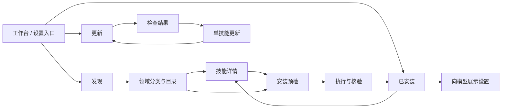

# Pi Web 技能中心 PRD

实施状态与逐条验收证据：[实施与验收记录](IMPLEMENTATION.md)。设计目标与实现验证状态分别记录。

版本：1.2 · 2026-09-12 · 状态：已进入实现，验证边界见实施记录。

本文与 [逐功能 Spec](specs.md)、[接口与数据契约](api-spec.md)、[页面设计](DESIGN.md) 共同组成实现合同。若图片里的小字与合同不一致，以 Spec 和接口契约为准。本文不把设计稿中的示例技能视为真实市场数据。

## 1. 摘要

将技能中心升级为计算机、金融、哲学、心理学、玄学五大领域工作台。保留“发现 / 已安装 / 更新”操作导航：发现首页是五领域总览并支持全部领域目录搜索，进入领域后展示二级分类与限定范围搜索；外部搜索单独进入，不与目录结果混合。已安装和更新共用领域筛选，默认全部领域。旧界面中的前端、代码等内容只是计算机领域的一部分。技能详情和安装面板跨领域复用。目标是让用户完成“找得到 → 看得懂 → 知道装到哪里 → 能管理 → 能判断更新结果”的完整流程。

视觉延续用户已选择的第三版 **Clear Horizon**；功能保留现有搜索、项目/全局安装、模型可见性设置、更新检查和单项更新。此次允许重新组织布局和入口，新增内容预览、明确安装目标、可解释的本地状态及操作结果恢复。首个市场来源仍为 skills.sh，不在第一期搭建新的市场服务。

交付物包含需求、接口合同、Product Design 页面设计及本地实现。第 8 节为实施分期基线；各阶段实际验证状态见 IMPLEMENTATION.md 与 acceptance.md，不将设计示例或测试数据标为已上线内容。

## 2. 联系人与决策责任

| 角色 | 责任 | 当前状态 |
|---|---|---|
| 产品决策人 | 范围、使用体验、设计调整与最终验收 | 项目用户 |
| 需求与设计整理 | 研究归纳、能力核查、Spec 与页面稿 | Codex，本次文档产出 |
| 实现与技术审核 | 契约可实现性、SDK/CLI 兼容、迁移与测试 | 实施时指定，不虚构人员 |

已确定：保留全部已有功能；允许调整布局和入口；使用 Clear Horizon；先设计与制定实现计划，再实施。本文给出可执行的默认方案，不把所有普通实现选择留给产品决策人。

## 3. 背景与事实

### 3.1 用户问题

技能现在集中在设置组件中，搜索、安装、管理与更新混在一起；用户难以在安装前确认用途、文件内容和目标位置，也难以区分“已安装”“已被当前项目加载”“已向模型展示”。市场页若仅更换卡片样式而没有补足这些数据，无法解决上述问题。

### 3.2 已核实的当前实现

| 能力 | 当前事实 | 对需求的约束 |
|---|---|---|
| 本地列表 | `DefaultResourceLoader` 返回当前上下文的有效资源，并附加锁文件信息 | 不是整台机器的完整安装清单；同名冲突可能隐藏副本 |
| 市场搜索 | `package / installs / url` 三个主要字段；API 失败可回退 CLI；当前服务端按安装量重排 | 不应直接宣称“相关性排序”；摘要、文件、许可证需要另行读取 |
| 安装 | skills CLI，指定 Pi，支持项目与全局 | 不能把注册中心团队命名空间当成本地安装作用域 |
| 开关 | 修改 SKILL.md 的 `disable-model-invocation` | 文案为“向模型展示”；关闭本身不禁止手动调用，但具体实例须被加载并可按名称定位；不是权限控制或卸载 |
| 生效时间 | 写文件与刷新面板不等于活动会话重新加载资源 | 成功提示必须写清“下次加载资源生效” |
| 更新 | 单技能、按作用域检查与更新；版本为哈希；部分来源不支持 | 不画未经支持的语义版本历史、回滚或仓库整包升级 |
| 诊断 | API 返回资源诊断，当前界面未完整呈现 | 新页应暴露冲突、不可读与信任问题 |

证据入口：[现有组件](../../components/SkillsConfig.tsx)、[现有类型](../../lib/api-types.ts)、[资源加载](../../lib/skills-service.ts)、[锁文件注解](../../lib/skill-lock.ts)、[更新逻辑](../../lib/skill-updates.ts)、[frontmatter 修改](../../lib/skill-frontmatter.ts)。已有测试只作为设计依据，本轮没有执行产品测试。

### 3.3 调研如何影响设计

- [skills.sh / skills CLI](https://github.com/vercel-labs/skills)：保留发现与分发链路；参考持续可见的搜索和来源信息。此仓库是 CLI，不代表整个目录网站开源。
- [ClawHub](https://github.com/openclaw/clawhub)：借鉴用途、内容、文件、来源分层；不移植未接入的审查徽章、Diff 和版本历史。
- [skillshare](https://github.com/runkids/skillshare)：借鉴本地搜索、筛选、紧凑管理列表；不引入多工具同步和备份系统。
- [SkillHub](https://github.com/iflytek/skillhub)：借鉴中文卡片与信息层级；团队库、发布和审核列入未来候选。

完整调研与截图见 [调研文档](../skills-market-research-2026-09-12/README.md)。以上是已完成调研的复用，不声称本轮再次运行了这些项目。

## 4. 目标与验收指标

### 4.1 产品目标

1. 用户可从五领域总览进入领域目录，按二级分类或任务关键词查找，查看真实来源和用途后进入安装流程。
2. 提交安装前明确技能、项目、作用域与服务端解析的目标位置。
3. 用户可区分磁盘中的安装实例、当前资源加载结果和模型可见性。
4. 检查失败、来源不支持、已经最新、存在更新有不同结果与后续动作。
5. 页面关闭、网络中断与重复点击不产生同一操作的重复执行，也不误报成功。

### 4.2 发布验收，不伪造增长指标

| 检查项 | 通过标准 |
|---|---|
| 主流程 | Spec F01–F22 的适用验收用例全部通过，无阻断失败 |
| 功能保留 | 现有搜索、项目/全局安装、开关、单项/全部检查和单项更新均有可达入口 |
| 安装确定性 | 每个写入动作均有服务端目标解析；重复 idempotency key 不重复启动 CLI |
| 状态准确 | CLI 结束但缺少可读取安装结果时不得显示“安装成功”；检查网络失败不得归类“已是最新” |
| 数据真实性 | 缺失字段用 null 与“未提供”，不捏造安装量、作者、版本、摘要或审查状态 |
| 内容读取 | 不执行远程 SKILL.md、脚本或嵌入 HTML；允许来源与文件路径边界测试通过 |
| 可访问性 | 13 张页面方案覆盖的桌面主视图及移动关键视图能用键盘/读屏完成核心操作；文字缩放 200% 无关键内容丢失 |
| 响应式 | 390、768、1280、1440 CSS px 宽度核心流程无页面级横向溢出；代码区域可单独横向滚动 |
| 操作反馈 | 提交后立即进入明确忙碌状态；不设置无法测量的固定“安装成功率”或上游响应时限承诺 |

安装完成时间、搜索无结果率、失败原因可通过本地调试记录评估。第一期不新增远程行为埋点，不向埋点服务上传关键词、文件路径或技能内容；用户主动外部搜索仍按既有功能将关键词发送给搜索来源。若日后需要产品指标，应先建立基线并明确数据收集范围。

## 5. 用户与场景

| 用户/场景 | 要完成的事 | 主要路径 |
|---|---|---|
| 初次使用技能的人 | 了解用途，完成首次安装 | 领域总览 → 领域目录/搜索 → 详情 → 安装 → 已安装 |
| 多项目开发者 | 确认哪个项目可用，避免误装全局 | 项目上下文 → 安装目标 → 作用域筛选 |
| 高频使用者 | 搜索已有技能，控制模型是否看到，手动调用 | 已安装 → 筛选 → 向模型展示 / 复制调用命令 |
| 维护者 | 检查更新，定位不支持和失败的原因 | 更新 → 检查 → 单项更新 → 验证结果 |
| 本地自定义技能用户 | 查看内容和加载诊断，不被强制纳入市场管理 | 已安装 → 本地来源 / 诊断 → 内容详情 |

第一期面向当前 Pi Web 主机上的单用户工作台；不增加账户体系、团队角色或远程设备控制。

## 6. 价值主张与范围

核心价值是将市场发现和本地管理连接起来，并说明每个操作到底影响什么。用户不需要先理解锁文件格式，但在排错时能够看到准确路径、来源和诊断。

### 6.1 本期纳入

| ID | 功能 | 当前基础 / 新增内容 | 优先级 |
|---|---|---|---|
| F01 | 入口、项目上下文、导航恢复 | 重组现有入口 | P0 |
| F02 | 远程关键词搜索、快捷搜索 | 复用查询；补空态和过期响应处理 | P0 |
| F03 | 结果卡片、排序、安装标记 | 新增元数据与准确实例匹配 | P0 |
| F04 | 技能概览和来源详情 | 新增远程/本地详情读取 | P0 |
| F05 | SKILL.md 和文件预览 | 新增只读内容接口 | P0 |
| F06 | 安装预检、目标选择 | 复用作用域；新增服务端预检计划 | P0 |
| F07 | 安装执行、验证与恢复 | 复用 CLI；新增操作记录和幂等 | P0 |
| F08 | 本地安装与资源清单 | 扩充可解释实例清单，不改变 SDK 加载顺序 | P0 |
| F09 | 已安装搜索与组合筛选 | 新增前端派生视图 | P0 |
| F10 | 向模型展示、手动调用说明 | 复用 frontmatter；补并发校验与生效说明 | P0 |
| F11 | 信任、同名冲突与诊断 | 呈现已有诊断并补管理状态 | P0 |
| F12 | 单项与全部检查更新 | 复用检查；补独立状态和检查时间 | P0 |
| F13 | 单技能更新预检、执行、核验 | 复用 CLI；补本地变更提示、开关保留与结果核验 | P0 |
| F14 | 操作记录与故障恢复 | 新增最小操作状态记录；非通用任务系统 | P0 |
| F15 | 无项目、未信任项目行为 | 明确全局可读/可装与项目边界 | P0 |
| F16 | 移动端、键盘、读屏 | 13 张设计图及其适用交互状态全覆盖 | P0 |
| F17 | 缓存、刷新和多窗口一致性 | 新增上下文隔离和失效规则 | P0 |
| F18 | 兼容迁移与回退 | 保留旧 API 与已有设置数据 | P0 |
| F19 | 五领域总览导航 | 固定顺序，配置驱动，不默认进入计算机 | P0 |
| F20 | 二级分类与跨领域归属 | 多对多映射、来源证据、待分类 | P0 |
| F21 | 领域目录检索与覆盖 | 本地版本化索引与外部搜索分开 | P0 |
| F22 | 跨页领域筛选恢复 | 恢复领域上下文，更新默认全部 | P0 |

每一项的触发、输入、数据、流程、异常和验收见 [Spec](specs.md)。P0 指本方案完整发布门槛，不表示所有功能应一次性合并。

### 6.2 本期不纳入

不新增卸载/回收站、自动批量更新、版本回滚、版本固定编辑、远程版本 Diff、市场发布、收藏评分、社区审核、私有团队库、多市场聚合、多 Agent 同步、技能编辑器。旧产品中已存在的功能必须保留，不将“未纳入新增能力”解释为删除旧功能。

不宣称某个技能兼容所有 Pi 配置；元数据中有声明时展示原文，缺失时说明“未提供”。不把来源署名或安装量包装成安全认证。

## 7. 解决方案

### 7.1 页面与流程

技能中心保留顶部当前项目和“返回工作台”。操作导航仍为三项，发现下设五领域总览和领域子页；详情和安装保留来源页面、领域、分类及搜索位置。移动端使用单列，安装切换全屏子页。设计图与版式合同见 [DESIGN.md](DESIGN.md)。

### 7.2 技术边界

复用已有路径安全、项目信任、CLI 调用、锁文件解释、frontmatter 与 SDK 加载辅助函数；不能为新界面另造不一致的路径授权规则。新 `/api/skill-center/*` 合同与旧 `/api/skills/*` 并存，避免直接改变旧请求/响应。

新增服务层只解决三件事：可解释的数据聚合、安装/更新前后核验、跨页面的操作结果追踪。目录元数据先支持现有 skills.sh 搜索结果对应的 GitHub 内容；不假设 skills.sh 提供尚未验证的通用详情 API。动态配置、地址、限额、超时均从现有配置机制或具名配置读取，不能写死开发机路径。

### 7.3 必须保持的语义

- **来源技能**：市场中的具体 skill；同一仓库可以有多个 skill。
- **安装实例**：具体作用域/项目/目标位置中的本地副本。
- **有效资源**：SDK 在当前上下文实际加载的资源；同名冲突依 SDK 结果解释。
- **向模型展示**：是否列入技能提示信息；不赋予或撤销执行权限。
- **可用更新**：同一实例采用可比较哈希算法发现内容变化；不是跨算法比较，也不是承诺语义版本升级。
- **操作成功**：写入后重新读取并核验结果；不能只依赖 CLI 文本。

### 7.4 主要约束和未知项

| 项目 | 当前判断 | 实施前验证/降级方式 |
|---|---|---|
| 搜索摘要 | 当前接口没有 | 详情解析补充；加载失败仍显示来源和名称，不编造摘要 |
| CLI 目标目录 | 存在链接与共享目录 | 用所安装 CLI 的实际行为验证解析器；预检和完成结果均显示解析后的逻辑路径，必要时展示物理路径 |
| 完整本地清单 | SDK 有效列表不覆盖全部实例 | 枚举授权的已配置根与已追踪记录，并与 SDK 结果比对；明确覆盖范围，不扫描整机 |
| 本地改动识别 | 旧实例没有文件基线 | 显示“无法判断”；更新需明确确认可能覆盖文件；有基线且已修改时先阻止更新 |
| 活动会话生效 | 现有面板不自动重新加载 | 文案固定说明下次加载生效；不自动打断或重建活动会话 |
| 网络与限流 | 外部来源可失败 | 本地管理独立可用；远程页给可重试原因，不制造空结果 |

详细问题无需现在打断用户；实现阶段若验证出 CLI 无法满足目标解析或结果核验，应提交具体差异再调整合同，不能静默降低验收标准。

## 8. 发布与执行计划

使用相对阶段，不编造排期。每阶段完成后再进入依赖它的阶段。

| 阶段 | 产出与边界 | 验证与进入下一阶段的条件 |
|---|---|---|
| R0 设计与合同（本次） | PRD、22 项 Spec、API、13 张页面稿（10 张桌面、3 张移动） | 链接与图稿存在，功能覆盖矩阵完整；不等于应用验证 |
| R1 数据合同与只读基础 | taxonomy/assignments 校验与版本化索引、身份、实例枚举、搜索/详情/文件、诊断 | 单测覆盖真实路径/锁文件/同名/缺失字段；路由契约与内容安全测试通过 |
| R2 本地管理与上下文 | 五领域总览与分类导航、跨页领域恢复、已安装筛选、模型展示、无项目/信任状态 | 旧功能回归、开关并发冲突、下次加载语义、不同项目隔离通过 |
| R3 安装与更新闭环 | 预检、单次操作记录、安装/更新/核验、断线恢复 | 重复提交、双窗口、失败/超时/服务重启、项目切换用例通过 |
| R4 视觉与发布 | 套用批准图稿、响应式、键盘/读屏、兼容移除旧界面重复入口 | 按设计检查表逐页比对；相关测试、typecheck、lint 通过；开发进程存续时禁止 next build |

保留旧 API；新界面异常可回到原工作台，不能通过删除用户技能或清空设置实现回退。任何最终切换必须满足 F18 的兼容用例，产品数据格式发生变化时单独审查。

实现前可重点调整的产品取舍：发现页卡片密度、详情页侧栏密度、安装面板宽度、移动页面信息顺序。所有调整应同步图片和 Spec，不能只改图片形成第二套语义。

## 9. 五领域分类与目录合同（1.1）

五个一级领域的顺序及稳定 ID 是本版产品合同；运行时名称、顺序、二级类目和快捷词来自服务端维护配置，不在页面组件散写。首版顺序不可被安装数量或远程结果改变。二级分类是可调整初稿，调整保留稳定 ID 或提供迁移映射。

| 顺序 | 稳定 ID | 领域 | 二级初稿 |
|---|---|---|---|
| 1 | computing | 计算机 | 前端设计、代码审查、文档工程、测试工程、研究工具 |
| 2 | finance | 金融 | 财务分析、投资研究、风险管理、量化研究 |
| 3 | philosophy | 哲学 | 逻辑与论证、伦理学、知识论、哲学史 |
| 4 | psychology | 心理学 | 认知心理、社会心理、发展心理、研究方法 |
| 5 | metaphysics | 玄学 | 易学、命理、风水、塔罗与象征 |

玄学按传统术数与象征研究方向组织，二级名称可调整；本合同与图稿示例不提供投资、心理诊断或其他专业建议。领域只是内容组织维度，与 global/project 安装作用域、文件授权、项目可信及模型展示设置完全独立。

一个 canonicalSkillId 可归属多个领域和多个二级分类，不复制来源身份、安装实例或操作记录。未知归属为“待分类”，不自动归入计算机。已安装和更新默认全部领域，包括待分类；更新检查全部始终覆盖当前授权范围全部实例，分类不删改检查目标。

现有市场没有已验证的官方领域过滤接口。新增本地、可版本化的人工维护分类索引，记录真实来源映射、分类依据 source URL/相对路径/证据摘录和核查时间。目录浏览仅声称“本地已收录”，不是 skills.sh 全市场分类。外部关键词搜索独立标注，结果中的归属由本地映射补充；本次返回集合内分类不宣称全市场覆盖，未归类结果仍可见。空领域显示真实空态，不把设计样例灌入目录。

### 9.1 13 张图的功能覆盖

| 编号 | 页面 | 覆盖 |
|---|---|---|
| 00 | 桌面五领域总览 | F01、F19、F21 |
| 01 | 计算机领域发现 | F02–F03、F19–F22 |
| 02 | 金融技能详情 | F04–F05、F10–F11、F20、F22 |
| 03 | 金融安装 | F06–F07、F14–F17、F22 |
| 04 | 跨领域已安装 | F08–F11、F15–F18、F20–F22 |
| 05 | 跨领域更新 | F12–F14、F17–F18、F20–F22 |
| 06 | 手机领域总览 | F16、F19 |
| 07 | 手机金融安装 | F06–F07、F14–F17、F22 |
| 08 | 手机跨领域管理 | F08–F11、F15–F18、F20–F22 |
| 09 | 金融领域 | F02–F03、F19–F22 |
| 10 | 哲学领域 | F02–F03、F19–F22 |
| 11 | 心理学领域 | F02–F03、F19–F22 |
| 12 | 玄学领域 | F02–F03、F19–F22 |

图稿中的技能仅为示意，真实内容需要来源证据。R1 验证重复/悬空 taxonomy、跨域去重、索引版本和 coverage；R2 验证导航恢复与待分类；R3 保持原可靠安装更新门槛；R4 按这 13 张图验收，不再按旧 8 图计算覆盖。

## 2026-09-12 两来源接入补充

本轮按用户确认范围新增 SkillsMP 与 agentskill.sh，保留 skills.sh。接口、来源身份、原生文件包安装、页面切换、验收与当前源站限制，以 [两来源接入说明](./multi-source-implementation.md) 为准。此前“仅 skills.sh”与“所有安装不固定预览版本”的表述限于原有 CLI 流程。SkillsMP 已通过真实安装核验；agentskill.sh 源站搜索 HTTP 500，真实下载安装仍待源站恢复后验证。
