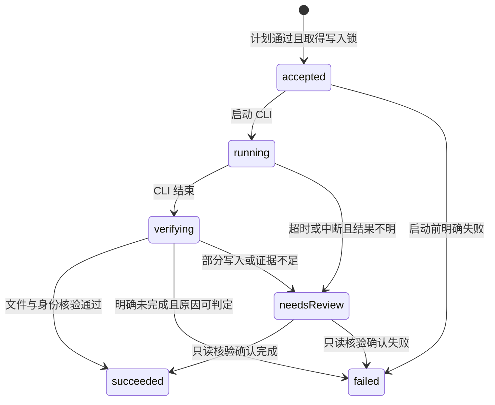

# 技能中心：数据、接口与状态合同

版本 1.2 · 2026-09-12 · **实现合同**。下文路由已加入本地实现；补充字段及限制见第 10 节，示例参数不代表本机真实资源。对应 [F01–F22](specs.md)。

## 1. 复用边界与兼容

| 现有路径 | 当前主要合同 | 新界面的复用方式 |
|---|---|---|
| GET `/api/skills?cwd=…` | `SkillsResponse`：有效技能、诊断、项目资源加载状态 | 复用资源加载，补充实例清单；不能直接冒充完整安装列表 |
| PATCH `/api/skills` | `filePath, disableModelInvocation` | 复用 frontmatter 修改辅助函数，新路由用实例 ID 与 revision |
| POST `/api/skills/search` | `query, limit?` → results | 复用上游搜索/CLI 后备，保留新接口的来源顺序和元数据状态 |
| POST `/api/skills/install` | `package, scope?, cwd?` | 复用 CLI 参数构造与执行，不复制旧的宽松 scope 默认语义 |
| POST `/api/skills/check` | `cwd, package?, scope?` → updates | 复用检查算法，将结果关联到实例和 revision |
| POST `/api/skills/update` | `cwd, package, scope` | 复用单技能更新，增加操作记录、设置保留和核验 |

旧路由保持公开结构，新 UI 使用 `/api/skill-center/*`。本方案不通过前端串调多个旧 mutation 来模拟一个可靠操作。底层应提取/复用服务函数，避免新服务经 HTTP 请求本机旧路由。

当前源代码校验不完全等同于本文严格合同：例如旧安装接口会将非 project scope 归为 global，旧 PATCH 未做完整布尔运行时校验。新接口必须显式验证，旧行为调整另做兼容测试。

## 2. 通用约定

- 请求/响应 JSON 为 UTF-8；新写接口要求 `Content-Type: application/json`。Basic Auth 拦截仍可能返回文本 401，客户端必须先看状态和 Content-Type。
- 服务器复用现有 Host/Origin、身份验证、允许路径与项目信任保护。任何不透明 ID 都不是授权凭证。
- `cwd: null` 表示只请求全局上下文；project scope 必须有获准 cwd。拒绝未知 scope、空 ID、非法布尔及错误字段类型，不悄悄采用另一作用域。
- 时间为服务端 UTC ISO 8601，前端按用户时区显示。版本值必须附算法/含义。
- 文件 revision 是服务端对当前内容的乐观并发标识，与上游版本哈希分开。过期 revision 返回 409。
- GET 仅读取；搜索 POST 仅为查询，不安装、不信任项目、不运行技能脚本。
- 限额、TTL、CLI 超时、轮询建议间隔及记录保留周期放入统一配置；默认值与来源见下表。文档不把机器地址或临时端口写成产品常量。

### 配置合同与建议默认值

这些数值是可覆盖的第一期工程参数，不是对上游性能或市场规模的统计结论。实现使用仓库现有环境/服务端配置机制，向前端仅暴露必要的 UI 限额和轮询提示；非法配置在启动校验时报错，不能静默采用无限值。

| 逻辑配置键 | 默认值 | 依据 / 行为 |
|---|---|---|
| search.defaultLimit / search.maxLimit | 50 / 50 | 延续现有搜索上限；整数，最小 1 |
| search.maxQueryLength | 200 个 Unicode 码点 | 本方案输入约束；超长返回 400，不静默截断 |
| search.timeoutMs | 20000 | 与现有 CLI 搜索时间预算对齐；API/后备各阶段应共享总截止时间，防止逐级叠加 |
| mutation.cliTimeoutMs | 60000 | 延续现有安装时间预算；超时不等于未写入，进入核验/待确认 |
| preview.maxTextBytes | 524288 | 单次文本预览 512 KiB；超限返回 too-large，禁止假装完整 |
| preview.maxTreeEntries | 1000 | 技能目录预览上限；达到限制返回 complete=false |
| metadata.cacheTtlMs | 300000 | 5 分钟可读缓存；刷新绕过缓存，snapshot 仍固定版本 |
| plan.ttlMs | 300000 | 预检有效 5 分钟；提交仍需重新校验 revision/权限 |
| operations.pollAfterMs | 1500 | 前台建议轮询间隔；客户端后台暂停，恢复时立即读取 |
| operations.retentionDays | 30 | 已终止记录与幂等摘要保留期；活动/待确认记录不自动清理 |
| operations.maxOutputBytes | 65536 | 脱敏后最多 64 KiB 日志摘要；正文明确是否截断 |

外部 API 的 Retry-After 优先于 UI 建议轮询时间；本地并发写入数固定为第一期架构约束 1，不开放未经验证的增大开关。敏感文件正文不写入浏览器长期缓存。

### 错误响应

```ts
interface ApiError {
  error: {
    code: string;
    message: string; // 可显示的本地化错误或安全摘要
    retryable: boolean; // 指读取/预检可重试；不授权自动重放写操作
    requestId: string;
    operationId?: string;
    field?: string;
    retryAfterSeconds?: number;
  };
}
```

| HTTP | code 例子 | 客户端处理 |
|---|---|---|
| 400 | INVALID_INPUT / INVALID_SCOPE / INVALID_PACKAGE | 定位字段，保持用户输入 |
| 401 | 现有认证层可能返回纯文本 | 提示重新认证，保留视图，不重复写入 |
| 403 | FORBIDDEN_PATH / PROJECT_UNTRUSTED | 解释不可用范围，进入已有信任流程或返回 |
| 404 | SKILL_NOT_FOUND / INSTALLATION_NOT_FOUND / OPERATION_NOT_FOUND | 刷新对应资源；操作未知不得视为失败后自动重试 |
| 409 | STALE_PLAN / REVISION_CONFLICT / TARGET_CONFLICT / BUSY / IDEMPOTENCY_CONFLICT | 分别重预检、重读、去管理、查看运行任务或修正请求 |
| 415 | UNSUPPORTED_MEDIA_TYPE | 报告调用错误 |
| 422 | AMBIGUOUS_SKILL / UNSUPPORTED_SOURCE / LOCAL_CHANGES | 解释具体阻断条件，不假装安装成功 |
| 429 | SOURCE_RATE_LIMITED | 显示上游限流，按提供时间提示重试 |
| 502/504 | SOURCE_UNAVAILABLE / CLI_TIMEOUT | 若已有 operationId，先查操作和结果，不直接重放 |

列表中的局部问题放在 diagnostics/item status 中；只有整体请求无法完成才使用顶层错误。文件过大、二进制等正常不可预览状态返回结构化内容状态，不导致详情整页 500。

## 3. 核心数据模型

以下为新增接口的规范性模型；实现可依仓库风格拆分类型，但不能合并不同语义的字段。

```ts
type Scope = "global" | "project";
type Context = { cwd: string | null };
type DomainId = "computing" | "finance" | "philosophy" | "psychology" | "metaphysics";
// 稳定领域 ID；运行时标签、顺序与类目来自已校验配置。
type MetadataState = "pending" | "ready" | "unavailable" | "ambiguous";

interface SourceSkill {
  canonicalSkillId: string; // 服务端规范化 provider+source+skill 标识
  provider: "skills.sh"; // 首期只有一个目录来源
  package: string; // 兼容既有 owner/repo@skillName 语义，不作为 shell 文本执行
  name: string;
  description: string | null;
  source: string;
  sourceType: "github" | "other";
  sourceUrl: string | null;
  directoryUrl: string | null;
  installCount: { display: string; numeric: number | null } | null;
  metadataState: MetadataState;
  classification: Classification; // 第 9 节；无映射为 unclassified
}

interface VersionIdentity {
  value: string;
  kind: "git-commit" | "git-tree" | "skills-content-hash";
  label: string;
}

interface Installation {
  installationId: string;
  classification: Classification; // 按可靠来源身份关联，不能按名称猜测
  canonicalSkillId: string | null;
  name: string;
  description: string | null;
  scope: Scope | "other" | "shared"; // other 自定义路径；shared 多范围共享；均非安装请求 scope
  contextId: string | null; // 项目实例上下文；全局/其他资源可为空
  source: string | null;
  managed: boolean;
  package: string | null;
  logicalPath: string;
  realPath: string;
  aliases: Array<{ path: string; scope: Scope | "other"; contextId: string | null; bindingId: string | null }>;
  managementBindings: Array<{
    bindingId: string;
    scope: Scope;
    contextId: string | null;
    package: string;
    source: string;
    sourceType: string | null;
    skillPath: string | null;
    ref: string | null;
    version: VersionIdentity | null;
    canCheckForUpdates: boolean;
  }>;
  managementBindingId: string | null; // 仅唯一管理绑定时设置；多绑定不任选一个
  revision: string; // 文件并发标识
  installedVersion: VersionIdentity | null; // 单绑定摘要；多绑定为 null，展开各 binding.version
  disableModelInvocation: boolean | null; // 无法解析则 null，禁止开关操作
  loadState: "effective" | "shadowed" | "excluded" | "untrusted" | "invalid" | "unknown";
  loadReason: string | null;
  capabilities: {
    readContent: boolean;
    setVisibility: boolean;
    checkUpdate: boolean;
    update: boolean;
    reasonByCapability: Record<string, string>;
  };
}

interface Diagnostic {
  id: string;
  code: string;
  severity: "info" | "warning" | "error";
  message: string;
  installationIds: string[];
  paths: string[]; // 仅返回已授权可展示路径
  rawDetail: string | null;
}

interface Inventory {
  taxonomyVersion: string;
  indexRevision: string;
  contextId: string; // 服务端规范化 cwd + 全局上下文的键
  revision: string;
  readAt: string;
  projectResourcesLoaded: boolean;
  installations: Installation[];
  diagnostics: Diagnostic[];
  coverage: {
    global: "complete" | "partial" | "unavailable";
    project: "complete" | "partial" | "untrusted" | "none" | "unavailable";
    description: string; // complete 仅指已授权配置范围，绝非整机
  };
}
```

标识规则：同名不等于同技能；同来源技能在不同物理目录不等于同实例。使用现有 `samePath`/路径规范化与真实路径检查，兼容 Windows 大小写和链接。实例 ID 可由稳定路径身份派生，不能使用数组索引；移动文件可能产生新 ID，旧 ID 写入必须失败。

共享实例的每个管理绑定必须保留原作用域、source/ref 和版本算法。只有一个管理绑定时允许按该绑定判断可更新能力；多个绑定时 `managementBindingId=null`，check/update capabilities=false，原因 `AMBIGUOUS_MANAGEMENT_BINDING`。即使其中一个绑定目前支持比较，也不能自动选它来覆盖其他管理记录。共享实例的顶层来源/package/canonicalSkillId 仅在所有绑定一致时作为共同摘要，否则为 null；卡片标记从具体绑定和 aliases 关联，不能丢弃某个作用域。位置筛选按 aliases 匹配，列表显示“多个位置”并允许展开。

`capabilities.update` 表示具备进入更新预检的基础能力，不意味着跳过本地变更、busy、revision 或信任校验。项目配置未读取时，卡片本地匹配状态应保持 unknown。

## 4. 只读与搜索接口

### 4.1 POST `/api/skill-center/search` — F02/F03

请求：`{ query: string, limit?: number, domainId?: DomainId | null, categoryId?: string | null }`。领域/分类仅是本次结果的分类上下文，禁止冒充上游领域过滤。返回完整本次结果，含非当前领域与待分类，客户端按第 9 节分组。

响应：`{ results: SourceSkill[], returnedCount: number, searchMode: "api" | "cli", ordering: "source", fetchedAt: string, taxonomyVersion: string, indexRevision: string, classificationSummary: ClassificationSummary, coverage: QueryCoverage, diagnostics: Diagnostic[] }`。

约束：query 非空且符合统一限额；limit 必须为正整数并在配置范围内，拒绝 null、负数和非数字。`returnedCount` 是去重后数量。原始安装量无法精确获得时保留 display、numeric=null。无需前端先选 cwd 才能搜索；本地标记来自独立 inventory。

2026-09-12 兼容修正：规范技能名支持 `stitch::react-native` 形式的命名空间；`installCount.display` 不包含英文 installs 单位，numeric 仍只保存精确整数。前端可从 K/M/B 缩写推导独立近似排序值，不回写 numeric。安装计划 requiredAcknowledgements 增加 `trust-project-resources`：仅用于尚未持久化信任决定的空项目首次安装，提交端要求明确确认后才保存 SDK 项目信任决定。GitHub API 源码读取失败时使用 Git 回退，内容快照仍固定至提交与 blob。

摘要可在详情被读取后补充缓存，不能为了所有卡片有描述而串行阻塞整次搜索。未读到时 metadataState=pending/unavailable。没有已验证的全市场 total，不返回虚构分页总数。首屏没有描述时直接使用缺失文案，不能假设设计图里的六段说明已经存在。

### 4.2 POST `/api/skill-center/inventory/query` — F08/F09/F11/F15

请求：`{ cwd: string | null }`；响应 `Inventory`。使用 POST 是为了避免绝对路径出现在 URL 历史/常规 URL 日志，语义仍为只读。此处不返回操作日志中的秘密或未授权路径。

服务端阶段：解析上下文 → 计算授权读取范围 → 被动枚举实例/锁记录 → 读取 SDK 有效结果（使用既有信任配置）→ 合并规范身份 → 诊断与覆盖说明。没有项目时必须只读全局配置，不能借假 cwd 加载任意项目内容。

### 4.3 POST `/api/skill-center/detail` — F04

请求为以下互斥一种：

```ts
type DetailRequest =
  | { kind: "remote"; canonicalSkillId: string }
  | { kind: "installed"; installationId: string; cwd: string | null };
```

响应：`{ skill: SourceSkill | null, installation: Installation | null, snapshotId: string, contentOrigin: "remote" | "local", description: string | null, skillRelativePath: string | null, version: VersionIdentity | null, metadataState: MetadataState, fileSummary: { count: number | null, complete: boolean }, diagnostics: Diagnostic[] }`。

适配策略：首先复用搜索解析出的来源；GitHub 来源用受限只读仓库内容读取器解析目标技能及原始 frontmatter。源协议/主机由已支持适配器生成请求，拒绝任意 URL 代理。不得假设存在未验证的 skills.sh `/detail` 接口。实施时必须针对实际 SDK/CLI 与官方 GitHub 接口验证路径/限额；如果无法唯一定位，返回 ambiguous，不猜一个目录。

快照固定本次阅读的内容版本。对非 GitHub 但旧安装支持的来源可返回 unavailable，并在预检中单独判断可安装性，不因为缺少富元数据删除既有安装能力。

### 4.4 GET `/api/skill-center/snapshots/{snapshotId}/files` — F05

响应：`{ files: Array<{ path: string, kind: "file" | "directory", size: number | null, previewable: boolean }>, complete: boolean, reason: string | null }`。

读取范围限定技能目录；如果达到配置上限且完整树不可得，complete=false 并说明原因，不能标注“全部文件”。快照绑定已验证来源/授权实例；过期或源不可取返回明确错误。

### 4.5 POST `/api/skill-center/snapshots/{snapshotId}/content` — F05

请求：`{ path: string }`（技能目录内相对路径）。

响应：`{ path: string, state: "text" | "binary" | "too-large" | "unavailable", text: string | null, mimeType: string | null, bytes: number | null, complete: boolean, sourceUrl: string | null }`。

内容只作为数据返回；不执行文件、不解释来自内容的代理指令。对本地快照仍重新验证文件路径权限与实际链接目标。正文 revision 变化时本地快照过期，重新读取详情，不混合新旧文件。

## 5. 安装/更新计划与写入合同

### 5.1 POST `/api/skill-center/plans` — F06/F13

```ts
type PlanRequest =
  | { kind: "install"; canonicalSkillId: string; cwd: string | null; scope: Scope }
  | { kind: "update"; installationId: string; cwd: string | null; expectedRevision: string };

interface Plan {
  planId: string;
  operationId: string; // 预留操作 ID；提交响应丢失时 GET 查询，不重放写请求
  classification: Classification; // 确认面板复用同一来源归属
  kind: "install" | "update";
  state: "ready" | "blocked";
  expiresAt: string;
  contextId: string;
  scope: Scope;
  skillName: string;
  source: string;
  target: { logicalPath: string; realPath: string | null; sharedAliases: string[] };
  currentVersion: VersionIdentity | null;
  observedSourceVersion: VersionIdentity | null;
  sourceVersionPinned: false; // 沿用当前更新追踪；不承诺固定预览提交
  localChanges: "none" | "detected" | "unknown" | "not-applicable";
  expectedRevision: string | null;
  requiredAcknowledgements: Array<"overwrite-unknown-local-changes" | "affects-shared-file">;
  blockers: Array<{ code: string; message: string }>;
  notices: string[];
}
```

计划是短期预检结果，服务器保存已规范化输入/配置指纹，浏览器不能修改返回路径来换目标。`realPath=null` 仅允许目标尚不存在且创建路径已验证；必须提供可验证逻辑目标。若 CLI 的实际目标规则无法确定，blocked，不能给虚假路径。

更新按实例唯一 managementBindingId 的 scope/lock/ref 执行，客户端不能在更新请求中换 scope。无绑定或多绑定返回 blocked，不能使用顶层 shared/other scope 构造 CLI。共享物理目录即使有唯一绑定，也需要显示影响范围；不同作用域只是链接到同一实例时不能承诺“只修改这个项目”。已知本地修改为 blocker，未知基线需要单独确认。预检 ready 不保证提交时仍 ready，必须再次校验。

### 5.2 POST `/api/skill-center/operations` — F07/F13/F14

请求：`{ planId: string, idempotencyKey: string, acknowledgements: string[] }`。

服务器执行顺序：

1. 校验请求、身份、幂等键与已有记录；相同 key/请求返回原 operation，不同请求返回 409。
2. 校验计划存在、未过期、当前上下文授权、目标/revision/配置指纹与确认项。
3. 原子获得主机技能写入门闩；已占用返回 409 BUSY，不创建一个假装已排队的任务。
4. 持久化 accepted 记录后再启动 CLI；若记录无法落盘不执行。
5. 使用参数数组和已验证 cwd/来源调用 CLI；不 shell 拼接任意仓库文本。
6. 更新进入 verifying；执行文件/身份/锁信息检查，更新需保留模型展示字段。
7. 写入终态和结果，释放锁；崩溃恢复遵循待确认流程。

接受时返回 202：`{ operation: Operation }`，重复终态请求可返回 200 同一结果。接口返回接受不等于操作成功。

```ts
interface Operation {
  operationId: string;
  kind: "install" | "update";
  state: "accepted" | "running" | "verifying" | "succeeded" | "failed" | "needs-review";
  contextId: string;
  projectLabel: string | null;
  scope: Scope;
  skillName: string;
  targetPath: string;
  createdAt: string;
  updatedAt: string;
  finishedAt: string | null;
  result: {
    installationId: string | null;
    actualVersion: VersionIdentity | null;
    visibilityPreserved: boolean | null;
    currentSourceStatus: "up-to-date" | "update-available" | "unchecked" | "error";
    reloadRequired: boolean;
  } | null;
  error: ApiError["error"] | null;
  outputExcerpt: string | null; // 限长、去控制字符和脱敏
  pollAfterMs: number | null; // 服务端配置给出建议；非后台自动写入
}
```

### 5.3 GET `/api/skill-center/operations/{operationId}` — F14

返回当前 `Operation`。只返回当前用户有权读取的捕获目标；操作状态随用户关闭页面继续保留。客户端按服务端建议轮询，后台窗口可降低频率，终态停止。认证失效不丢失 operationId。

### 5.4 POST `/api/skill-center/operations/{operationId}/reconcile` — F14

请求空 JSON。只重新读取文件/锁/进程状态，**不启动或重新执行 CLI**。允许 needs-review，结果可变 succeeded/failed，也可仍 needs-review。没有充分证据时不得用猜测填 succeeded。普通安装重试必须由新计划、新 key、明确用户操作开始。

操作账本至少在配置保留期内保留幂等 tombstone；活动与待确认操作不自动清理。过期 key 的处理必须仍能拒绝旧计划，不能遗失记录后接受同一旧任务。记录路径从服务端 Agent 状态目录解析，禁止硬编码本机用户路径。

### 5.5 本地基线记录

成功安装/更新后，在独立辅助元数据中记录 installationId、规范化相对文件清单、每个文件的内容摘要和生成时间，不写回 CLI 锁文件。读取范围限于技能目录；无法完整枚举、文件不可读或出现越界链接时基线为 unknown，不能标 none。比对需检查新增、删除与修改文件。

SKILL.md 的 `disable-model-invocation` 是受本产品管理的独立设置。可见性写入成功时仅更新该文件对应的已知摘要，且必须确认写入前 revision 等于已知基线；若用户已修改其他正文/字段，不能通过更新摘要把这些改动“洗成”无修改。没有基线的旧实例仍保留 unknown。基线不是备份，也不提供回滚保证。

## 6. 可见性与更新检查接口

### 6.1 PATCH `/api/skill-center/installations/{installationId}/visibility` — F10

请求：`{ cwd: string | null, expectedRevision: string, disableModelInvocation: boolean, acknowledgeSharedFile?: boolean }`。

响应：`{ installation: Installation, effectiveWhen: "next-resource-load" }`。

与安装/更新使用相同写入互斥边界；必须先比较文件 revision。真实路径存在且为允许范围内的 SKILL.md，布尔类型严格验证。共享文件未确认返回带影响说明的 409，而非悄悄修改其他别名。保留原文件格式和无关字段。成功不会给当前会话发送 reload/prompt。

### 6.2 POST `/api/skill-center/checks` — F12

请求：`{ cwd: string | null, installationIds?: string[] }`；省略列表表示覆盖范围全部实例，显式空列表返回空结果，不默认为全部。

响应：

```ts
interface CheckResult {
  installationId: string;
  basedOnRevision: string;
  state: "up-to-date" | "update-available" | "unsupported" | "error";
  currentVersion: VersionIdentity | null;
  sourceVersion: VersionIdentity | null;
  checkedAt: string;
  stale: boolean;
  reasonCode: string | null;
  message: string | null;
}
// { results: CheckResult[], checkedAt: string, diagnostics: Diagnostic[] }
```

检查是只读请求，不进入安装/更新操作账本；有界并发与请求缓存复用既有算法，限额用统一配置。界面可请求单项，检查全部可一次返回完整数组，不要求第一期加入 SSE。`unchecked/checking` 是客户端状态，不能存为检查成功结果。服务器检查结束再次比较本地 revision，变化时 stale=true。

## 7. 状态机与不可破坏条件



图中的 needsReview 对应 API `needs-review`。服务器重启的非终态也进入待确认，不能从 needs-review 自动转回 running。succeeded 只代表本地操作达到合同；是否最新由 result.currentSourceStatus 单独表达。

必须保持：一个安装/更新意图只有一个 operationId；同一物理文件在写入期间不能并发修改开关；项目切换不会改变 operation 捕获目标；检查与远程详情读取不执行远程内容；新记录不能伪装 CLI 原有锁文件；外部 CLI/编辑器不受本服务门闩控制，因此必须保留 revision、后置核验与待确认结果。

## 8. 实现验证清单

| 测试层 | 最小必要案例 |
|---|---|
| 单元 | 身份规范化、Windows 路径/链接、scope 匹配、坏锁文件、部分清单、排序空值、可见性最小修改、版本算法区分 |
| 路由合同 | 严格输入、401 文本、403 信任、409 revision/busy、过期计划、相同/不同幂等请求、未知实例、文件限额 |
| 操作集成 | 双窗口并发、CLI 失败/超时、成功但无文件、更新开关保留、源变化、服务重启、仅核验不重跑 |
| 端到端 | 发现→详情→项目/全局安装→管理、返回恢复、同名实例开关、检查多结果、手机确认和焦点返回 |
| 兼容 | 旧 API 代表性请求、已有锁文件/自定义目录、SDK 加载顺序、插件资源、活动会话不自动 reload |

测试不得只镜像类型定义；必须观察是否实际启动多次 CLI、是否改错文件、是否保留未触碰内容、是否误报成功。上述是未来验收要求，本次文档任务未执行这些测试。


## 9. 五领域 taxonomy、归属及目录查询 — F19–F22

### 9.1 配置与版本

领域顺序与稳定 ID：computing（计算机）、finance（金融）、philosophy（哲学）、psychology（心理学）、metaphysics（玄学）。服务端从人工维护的版本化配置加载 labels/order/categories，页面不得复制一份常量。一级集合/顺序是 1.1 校验约束；调整需版本迁移。二级初稿如下，可调整文案但不静默重用 ID：

| domainId | categoryId → label |
|---|---|
| computing | frontend-design → 前端设计；code-review → 代码审查；document-engineering → 文档工程；test-engineering → 测试工程；research-tools → 研究工具 |
| finance | financial-analysis → 财务分析；investment-research → 投资研究；risk-management → 风险管理；quantitative-research → 量化研究 |
| philosophy | logic-argumentation → 逻辑与论证；ethics → 伦理学；epistemology → 知识论；history-of-philosophy → 哲学史 |
| psychology | cognitive-psychology → 认知心理；social-psychology → 社会心理；developmental-psychology → 发展心理；research-methods → 研究方法 |
| metaphysics | yi-studies → 易学；destiny-studies → 命理；feng-shui → 风水；tarot-symbolism → 塔罗与象征 |

categoryId 在本 taxonomy 全局唯一，父级不可隐式改变；玄学类目为传统术数与象征研究方向的初稿。维护索引不增加网页编辑/发布后台，首期由配置文件审查流程维护；本轮不生成假生产索引。

```ts
interface Taxonomy {
  version: string;
  indexRevision: string;
  domains: Array<{
    id: DomainId; label: string; order: number; description: string;
    categories: Array<{ id: string; label: string; order: number }>;
    quickQueries: string[];
  }>;
}
interface Assignment {
  canonicalSkillId: string;
  domainId: DomainId;
  categoryId: string | null;
  evidence: { sourceUrl: string; relativePath: string | null; excerpt: string | null; verifiedAt: string };
  // sourceUrl 必须关联真实来源技能；非搜索关键词推断
}
interface Classification {
  state: "classified" | "unclassified";
  assignments: Array<{ domainId: DomainId; categoryId: string | null }>;
  taxonomyVersion: string;
  indexRevision: string;
}
interface ClassificationSummary {
  classifiedUnique: number;
  unclassifiedUnique: number;
  currentDomainUnique: number | null;
  outsideCurrentDomainUnique: number | null;
}
interface QueryCoverage {
  kind: "local-index" | "external-result-set";
  taxonomyVersion: string;
  indexRevision: string;
  indexedUnique: number | null; // 当前本地索引 canonicalSkillId 去重总量
  totalMatched: number | null; // local-index 完整匹配数；外部为 null
  returnedCount: number;
  truncated: boolean;
  marketTotal: null; // 没有全市场已验证数量
  completeWithinIndex: boolean | null; // 外部为 null
  description: string;
}
```

配置源含 taxonomy、真实 SourceSkill 目录条目、assignments；taxonomyVersion 变更表示分类合同变化，indexRevision 在条目/归属/证据变化时变更。三者原子发布，拒绝混读版本。检验一级顺序/集合、category 唯一与父级、技能 ID 存在、映射三元组唯一、sourceUrl 与真实来源一致、时间和字段类型合法；证据必须有 sourceUrl 且 relativePath/excerpt 至少一项可核查。无人工映射时 assignments=[]、unclassified，不能自动计算机。多域计数不相加当去重总量。

校验失败保留上次有效快照并用 diagnostics 报告配置错误；无有效快照返回 503 TAXONOMY_UNAVAILABLE / INDEX_UNAVAILABLE。后续索引升级不能改写 CLI 锁、安装身份、scope、文件权限或模型展示值。来源无法可靠匹配的本地实例保持待分类；共享绑定来源不一致时不凭名称归类。

### 9.2 GET `/api/skill-center/taxonomy`

响应：`{ taxonomy: Taxonomy, counts: Array<{ domainId: DomainId, indexedUnique: number }>, coverage: QueryCoverage, diagnostics: Diagnostic[] }`。

无 cwd，纯配置/索引读取，不触发外部搜索、安装或信任。counts 表示本地已收录领域去重数，不是已安装数或全市场数；若不可获得完整有效索引，整体返回上述 503，不伪造 0。有效空索引返回 0，五领域仍完整显示。coverage.kind=local-index，totalMatched/indexedUnique 为索引去重总量。可使用版本 ETag；刷新返回同版本不能制造新数据。

此 taxonomy 响应不返回技能条目，因此 coverage.returnedCount=0；truncated=false，completeWithinIndex=true 表示领域统计基于完整有效索引，不表示客户端已拿到完整技能列表。目录条目须另行调用 catalog/query。

### 9.3 POST `/api/skill-center/catalog/query`

请求：`{ query?: string, domainId?: DomainId | null, categoryId?: string | null, classificationState?: "all" | "classified" | "unclassified", limit?: number }`。

响应：`{ results: SourceSkill[], ordering: "index", taxonomyVersion: string, indexRevision: string, coverage: QueryCoverage, diagnostics: Diagnostic[] }`。

query 允许空或省略，trim 后按本地已收录 name/description/source 做大小写不敏感子串匹配；领域和分类与 query 按 AND。domainId=null/省略表示所有领域；categoryId 非空必须提供所属 domainId，否则 400 INVALID_CATEGORY。未知 domain/category 返回 400 INVALID_DOMAIN/INVALID_CATEGORY。unclassified 与具体 domain/category 互斥，组合返回 400；待分类不属于任一领域，但在所有领域中可见。limit 使用统一搜索限额；本期无 cursor，不展示假分页，超出时 coverage.truncated=true，明确提示缩小查询范围。

同技能多映射先筛选再按 canonicalSkillId 去重，默认人工配置的稳定条目顺序（不是市场排名）。totalMatched 为截取前匹配唯一技能数，returnedCount 为本次实际数，completeWithinIndex=!truncated；marketTotal 始终 null。目录无记录是真空态；有效索引仅指已收录映射覆盖，不声称全市场分类完成。

### 9.4 外部搜索与本地管理的领域语义

4.1 search 的 domainId/categoryId 使用同一校验，不作为 skills.sh/CLI 参数。始终对原始上游结果做 canonical 去重、保留来源顺序，附本地 Classification；coverage.kind=external-result-set、totalMatched=null、completeWithinIndex=null，returnedCount 仅指本次返回数。classificationSummary 用该集合计算；无法判断上游是否有更多时 truncated 表示已知的本地截取，不承诺上游完整。当前领域/待分类/其他领域可以分组，分组内保留来源顺序，所有组均有可见入口；未分类不可隐藏或默认计算机。

inventory/query 继续返回完整授权范围，新增顶层 `taxonomyVersion/indexRevision`，每个 Installation 携带 Classification；domain/category 不作为服务器安装清单缩减参数。F09 本地组合筛选使用响应完整集合；筛选结果数量为实例数，不能与目录来源技能数混比。checks 仍按当前授权范围全部实例或显式 installationIds 处理，检查全部不传领域过滤后的 IDs；领域筛选只影响结果展示并报告隐藏数量。操作计划/执行与原合同一致，不接受 domainId 代替 scope。

跨页恢复保存视图的 domain/category/classificationState 与 taxonomyVersion；新版本删除 ID 时清除无效分类并显示提示，不把其映射到计算机。目录缓存含 query/domain/category/classificationState/taxonomyVersion/indexRevision；外部原始搜索缓存和分类展示缓存分开，防止旧归属覆盖新索引。

### 9.5 分类合同验证

至少覆盖：五领域顺序、二级父子校验、同技能跨域去重、未知不归计算机、缺证据拒绝、原子版本切换、空领域、外部结果待分类可见、目录 total/limit/coverage、外部源顺序、管理全部领域包含待分类、检查全部不被筛选缩窄、旧 API 不变。所有验证是未来实现门槛，本次只修改文档。


## 10. 实施补充（2026-09-12）

本节记录实现时为故障恢复加入的兼容字段；不降低前述验收要求。实际验证状态见 [实施与验收记录](IMPLEMENTATION.md)。

- `Plan.operationId` 在预检时预留。浏览器在 POST operations 前保存它；收到 202 后仍使用同一个 ID。响应丢失时只 GET 查询，404 不触发安装。
- `Plan.classification` 为确认面板提供领域标签。分类从索引读出，不按技能名称猜测。
- 详情另返回 `previewPath`（快照内入口文件相对路径）、`license`、`compatibility`、`evidence`。后两类声明未提供时为 null；evidence 为当前来源的归属证据数组。`skillRelativePath` 仍保留来源中的完整相对位置。
- `GET /api/skill-center/write-status` 返回 `{busy, operationId, recoverable}`；`POST /api/skill-center/write-status/reconcile` 仅恢复已证明命令未启动的死租约，不执行 CLI。损坏或无法核实的租约保持保护。
- 初始分类读取失败时 taxonomy/catalog 仍返回错误；独立外部搜索、本地清单和内容读取可继续。此时版本标记为 `unavailable`，归属未确认，coverage.indexedUnique 为 null，不能呈现为零收录。
- 安装及更新统一核对 CLI 的 Pi 入口、共享存储和锁目标。CLI 无法写回的自定义实例返回 `UNSUPPORTED_TARGET`，不把另一个目录的安装当作选中实例的更新。
- Windows managed CLI 使用执行预算与终止预算各一次；只有确认进程树结束才核验文件。进程树无法确认时返回 `PROCESS_UNCONFIRMED`、保留操作与租约，不自动重试/解锁。主机进程核查属于故障处理，不能用“PID 已消失”代替整树停止证明。
- 操作元数据目前保留，不自动清除历史；`retentionDays` 为最低保留期，尚未加入周期清理调度。无后台自动重跑任务。

## 11. 已安装技能个人分类

`PATCH /api/skill-center/installations/:installationId/classification`

请求字段：`cwd: string | null`、`expectedRevision: string`（安装文件版本）、`expectedClassificationRevision: string | null`（无个人覆盖时为 null）、`taxonomyVersion: string`、`indexRevision: string`、`assignments: Array<{domainId, categoryId: string | null}>`、可选 `reset: boolean`。

- 空 assignments 明确保存为待分类；categoryId 为 null 表示只选领域。拒绝不存在的领域、父子不匹配、缺失 categoryId、重复组合；同一领域同时提交领域级和方向级归属时仅保留方向级。
- `reset: true` 移除个人覆盖。请求仍需提供当前版本与合法 assignments；UI 从当前有效草稿生成请求。
- 成功返回 `{installation: Installation}`。Classification 新增可选 `origin: "personal"`、`personalRevision: string`；未覆盖时保留原合同。
- 版本冲突：409 `REVISION_CONFLICT`、`CLASSIFICATION_CONFLICT` 或 `TAXONOMY_CHANGED`；输入无效为 400；个人分类文件无法读取为 503 `INVALID_CLASSIFICATIONS`。写入忙时沿用现有门闩错误。
- 通过现有已授权清单定位安装实例，复用路由同源校验、写入租约及原子 JSON 保存。已追踪技能按 canonicalSkillId 共享覆盖，未追踪技能按 installationId 分开保存。
- 个人分类仅改变归属，不添加目录条目、不影响 skills.sh 安装量。目录计数按收录条目的有效归属去重统计。

完整使用和验证见 [分类功能实施记录](classification-editing.md)。


## 2026-09-12 两来源接入补充

本轮按用户确认范围新增 SkillsMP 与 agentskill.sh，保留 skills.sh。接口、来源身份、原生文件包安装、页面切换、验收与当前源站限制，以 [两来源接入说明](./multi-source-implementation.md) 为准。此前“仅 skills.sh”与“所有安装不固定预览版本”的表述限于原有 CLI 流程。SkillsMP 已通过真实安装核验；agentskill.sh 源站搜索 HTTP 500，真实下载安装仍待源站恢复后验证。
