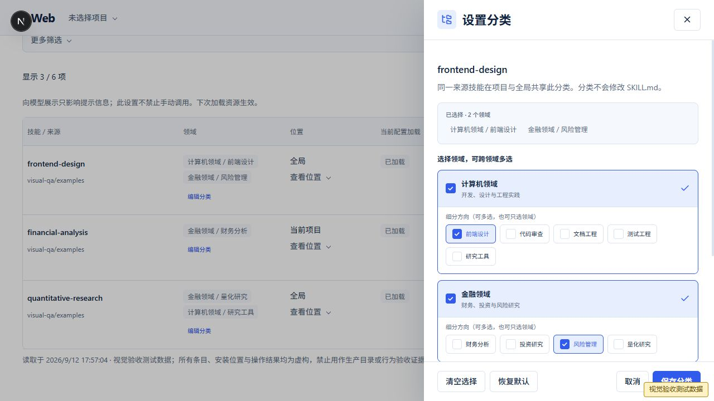

# 已安装技能分类与控件优化

实施日期：2026-09-12。

## 使用方式

1. 打开「技能中心 → 已安装」。每条技能的领域标签下新增「设置分类」或「编辑分类」，已安装技能详情也有入口。
2. 勾选计算机、金融、哲学、心理学、玄学中的一个或多个领域。每个领域可以只选领域，也可以选择多个细分方向。
3. 点击「保存分类」。列表、详情和领域筛选会刷新；重新读取清单时保留分类。
4. 「清空选择」只清空编辑草稿，保存后成为待分类；「取消」不保存草稿。「恢复默认」直接移除个人覆盖，回到目录原有归属，没有目录归属则为待分类。

## 保存与归属规则

- 分类保存在当前 Pi Agent 状态目录的 `skill-center/classifications.json`，不写入技能的 `SKILL.md` 或安装锁文件。因此正常更新技能内容不会覆盖个人分类。
- 可追踪来源的技能以 `canonicalSkillId` 关联，同一来源技能的全局和项目安装共享个人分类。
- 无法追踪来源的本地技能以安装实例关联，不因名称相同而合并。
- 分类使用现有 taxonomy 提供的领域和方向；不根据名称推断归属，不新增固定生产数据。
- 个人分类优先于目录原有分类，在相同来源的检索结果和详情中保持一致。它不会自动把外部技能加入维护的本地目录；发现页的「本地已收录」仍统计目录收录条目，不是已安装数量。
- 文件版本、个人分类版本及分类目录版本均参与保存校验。其他页面已修改分类时返回冲突，避免旧草稿覆盖新设置；安装或更新正在写入时复用现有写入门闩。

## 控件与布局

复用项目已有 Tailwind CSS 和主题变量，不增加样式依赖。技能中心的 9 处原生下拉改为统一组合框，包括领域、方向、排序、位置、更新状态及更多筛选；支持方向键、Home、End、Enter、Escape、Tab 和点击外部关闭。

统一按钮、复选框、单选框、折叠入口、筛选面板和选中状态。分类编辑使用抽屉，领域卡片和细分方向标签均可点击；保存期间禁止重复操作。手机端为全宽面板，底部保留取消和保存按钮。

## 验证

- 64 项针对性自动测试全部通过：`node --test lib/skill-center/*.test.mjs components/skill-center/*.test.mjs lib/skill-lock.test.mjs lib/skill-updates.test.mjs lib/project-trust.test.mjs`。
- 新增 3 项分类回归测试，覆盖真实临时目录持久化、不修改 SKILL.md、内容更新后保留分类、来源关联、本地实例隔离、清空、恢复默认、非法领域与方向、文件/目录/个人版本冲突、写入互斥和 HTTP 响应。
- `npx tsc --noEmit --pretty false`、`npm run lint`、`git diff --check` 通过。
- 浏览器验证：跨领域保存后立即更新标签及筛选结果；详情入口、清空后取消、下拉键盘选择可用；390×844 面板宽度和页面滚动宽度均为 390px，没有横向溢出；浏览器未记录 console error。
- 多技能交互及截图使用明确标记的内存 QA 代理，只验证实际前端 bundle 的布局和交互；数据持久化由真实临时文件系统回归测试验证。实际开发应用已确认已安装技能的分类入口可用，没有替用户选择分类。
- 按仓库要求，开发预览运行期间未执行 `next build`；本次未重跑全仓测试，历史全仓验证边界见 [实施记录](IMPLEMENTATION.md)。

## 界面截图

### 浏览器批注修订：布局与反馈

发现导航回归修复：每次主动点击「发现」（包括已处于该标签时再次点击），重置领域、细分方向、查询、输入草稿、外部搜索模式和排序，回到五领域总览并滚动到顶部。「发现技能」空态入口使用同一行为。详情页的「返回原列表」仍保留原来的浏览上下文。浏览器已执行两条回归路径：金融领域 → 风险管理 → 已安装 → 发现；外部搜索输入草稿 → 再次点击发现。两条路径均回到五个领域入口，搜索框为空，内容滚动位置为 0。

针对用户标注的 1082px 页面，本轮修复如下：

- 1100px 以下不再把七列直接挤成无表头的三列。安装实例采用分区卡片：名称/来源、分类、位置；加载/模型展示/更新状态；底部操作区。手机端重新排列为两列状态区域。保留可访问表头，并给卡片中的状态补充可见标签。
- 已成功的历史安装不再占据常驻状态横幅，可通过顶栏「最近操作」查看结果及日志。进行中、失败或待核验操作仍保留状态入口。
- 分类保存使用右下角浮层，5 秒后自动关闭，也可以手动关闭；需要处理的一般通知保留关闭入口、不自动隐藏。现有清单刷新时只更新刷新按钮状态，不插入占位横幅；首次读取仍显示加载反馈。
- 浏览器已验证真实技能在不改变归属的情况下保存，浮层出现后自动消失，内容区无成功横幅；历史结果入口可用。已检查 1082×912、390×844 和 1440×960 布局，手机及宽屏无横向溢出。
- 新增 2 项渲染回归测试，检查卡片状态标签、可访问表头/操作、通知关闭入口与消息转义。本轮 66 项针对性测试、TypeScript 和 ESLint 通过。生产构建仍遵守开发服务运行期间不执行的仓库约束。

修订后的真实应用截图：[1082px 布局](implemented/layout-feedback-1082.png)、[手机卡片](implemented/layout-feedback-mobile.png)。下方较早截图仅记录分类编辑器。

以下截图包含「视觉验收测试数据」标记，技能归属仅用于验证交互，不代表这些来源技能的真实分类。

桌面分类编辑：

390px 手机分类编辑：

