# 20 页设计对照

用户选择：第 3 版 Clear Horizon。以下设计图与原始 01–20 一一对应；图片是视觉参考，真实交互以现有功能及本页校正规则为准。

## 01 初始首页

首次进入保留打开目录/创建工作目录入口；设置模型为明确下一步。

| 原界面 | 设计图 |
|---|---|
|  | 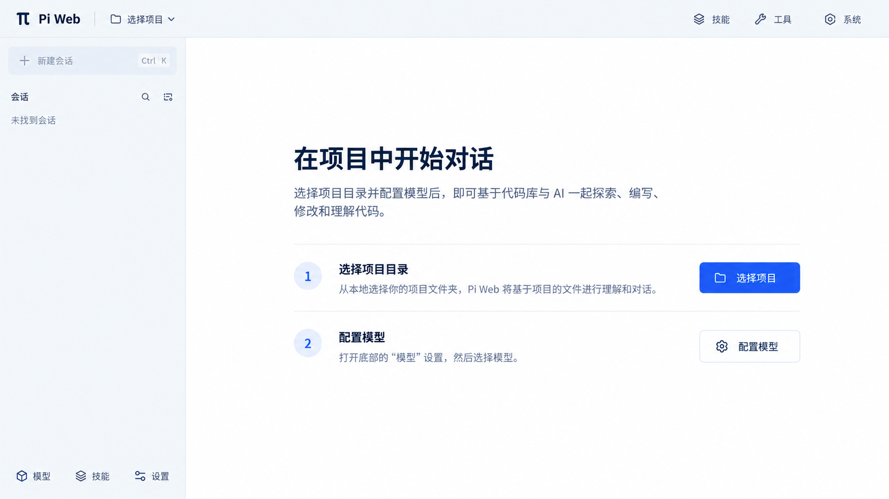 |

## 02 常规设置

常规设置提高标题和说明字号，外观/语言/终端分组。

| 原界面 | 设计图 |
|---|---|
|  | 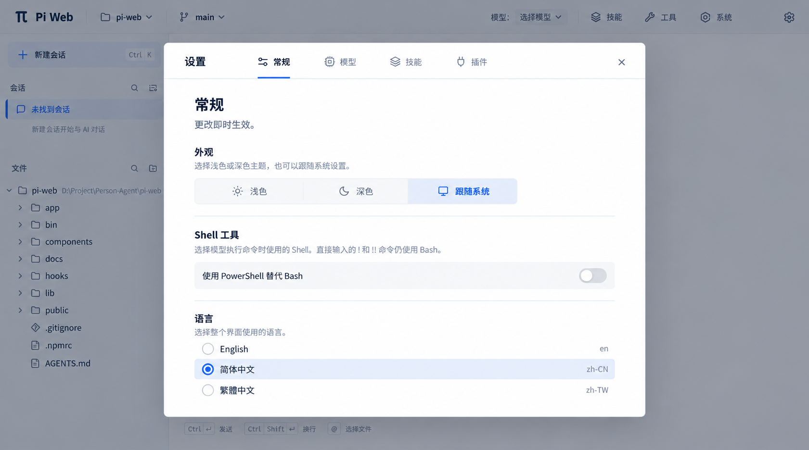 |

## 03 模型空态

模型空态提供添加供应商；保存仅在已有可保存修改时启用。

| 原界面 | 设计图 |
|---|---|
|  | 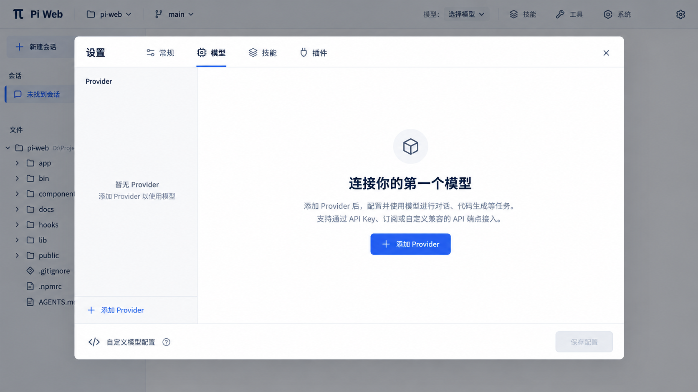 |

## 04 Provider 选择器

供应商保持现有即时选择流程；不增加生成图底部多余确认。

| 原界面 | 设计图 |
|---|---|
|  | 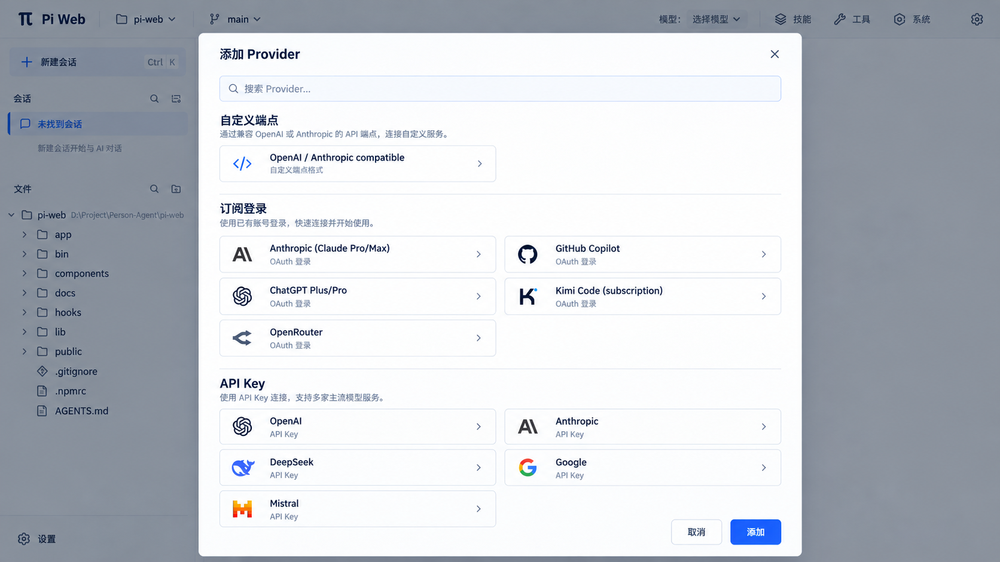 |

## 05 项目选择菜单

项目选择移至桌面顶部，继续支持历史项目与目录选择。

| 原界面 | 设计图 |
|---|---|
|  |  |

## 06 目录浏览弹窗

目录弹窗输入、目录列表、最终选择明确分层。

| 原界面 | 设计图 |
|---|---|
|  | 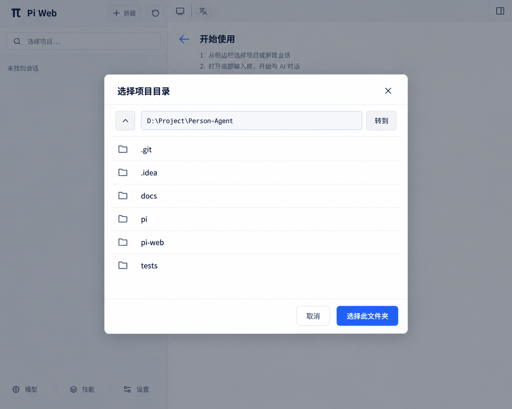 |

## 07 项目工作台

统一工作台；桌面顶部项目/分支，侧边会话/文件，中央输入。

| 原界面 | 设计图 |
|---|---|
|  | 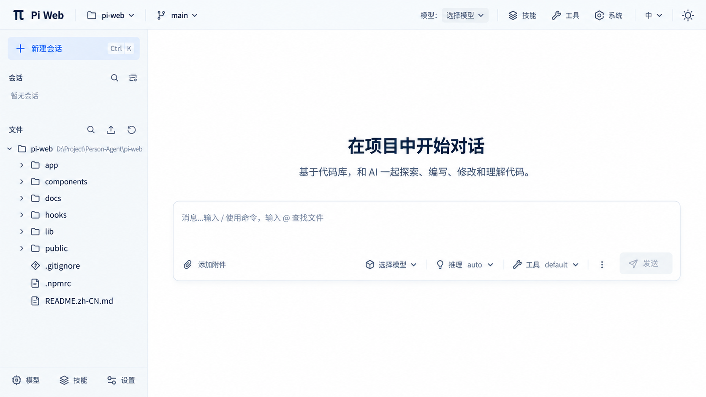 |

## 08 Worktree 菜单

worktree 当前态、主分支与新增入口分组。

| 原界面 | 设计图 |
|---|---|
|  | 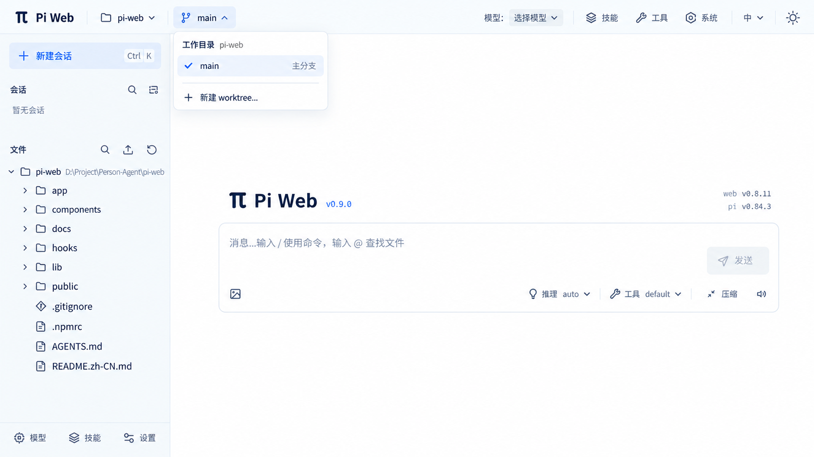 |

## 09 Worktree 创建表单

分支输入与创建行为保持现有验证。

| 原界面 | 设计图 |
|---|---|
|  | 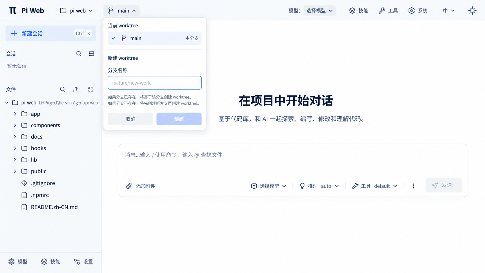 |

## 10 推理菜单

8 个真实推理值，auto 不承诺额外推理强度。

| 原界面 | 设计图 |
|---|---|
|  | 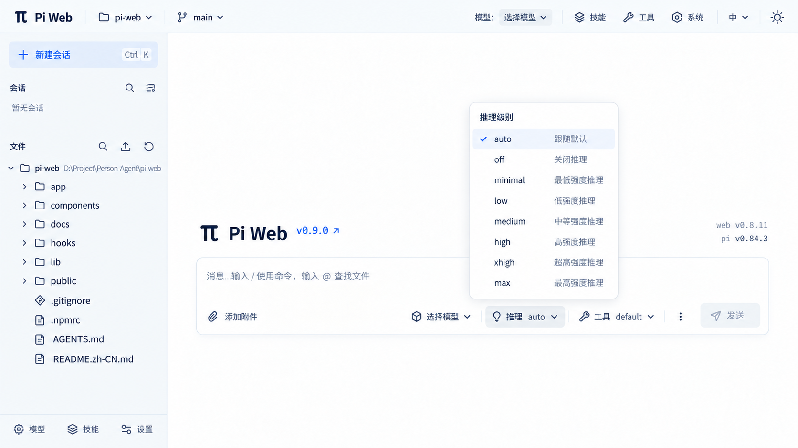 |

## 11 工具预设菜单

4 个真实工具预设，保留压缩与声音。

| 原界面 | 设计图 |
|---|---|
|  | 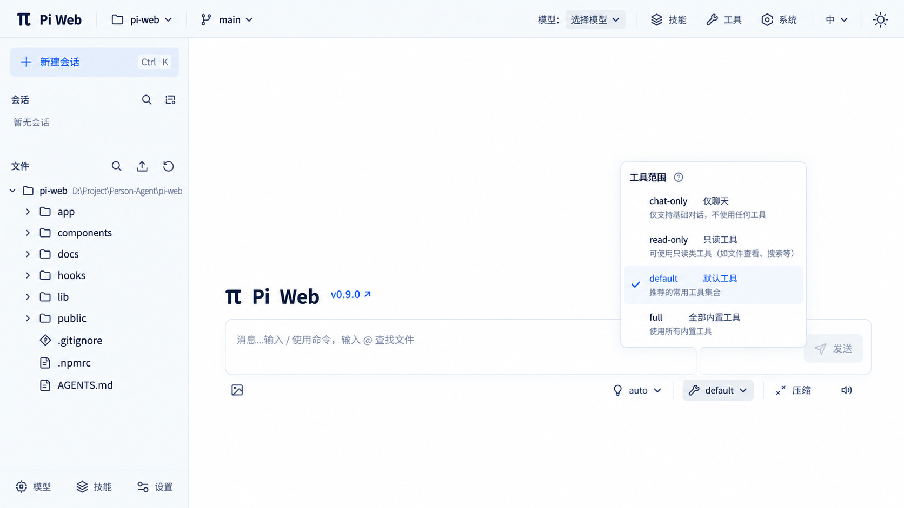 |

## 12 Markdown 预览

只读 Markdown 预览；真实文档；引用、下载保留。

| 原界面 | 设计图 |
|---|---|
|  | 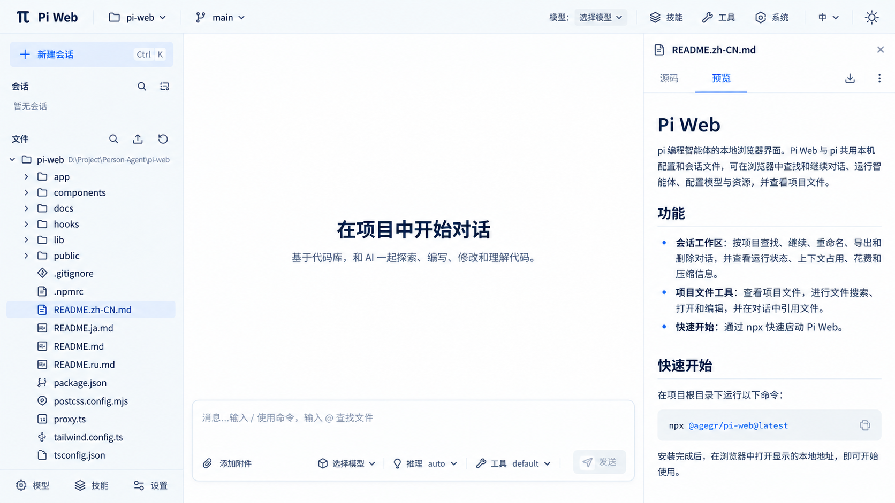 |

## 13 源码模式

源码只读、真实行号和换行；有变更才出现 Diff。

| 原界面 | 设计图 |
|---|---|
|  | 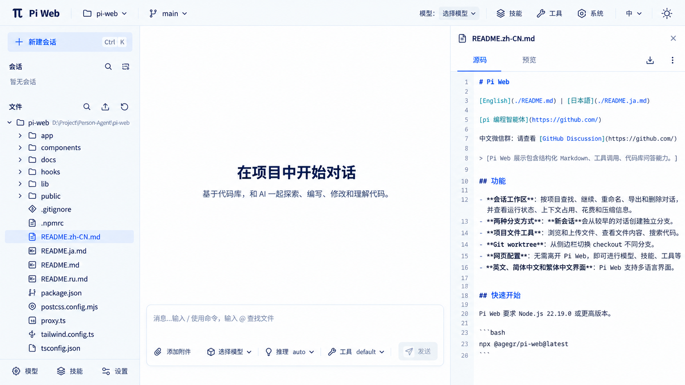 |

## 14 技能管理空态

无技能空态引导添加；保留现有技能禁用开关。

| 原界面 | 设计图 |
|---|---|
|  | 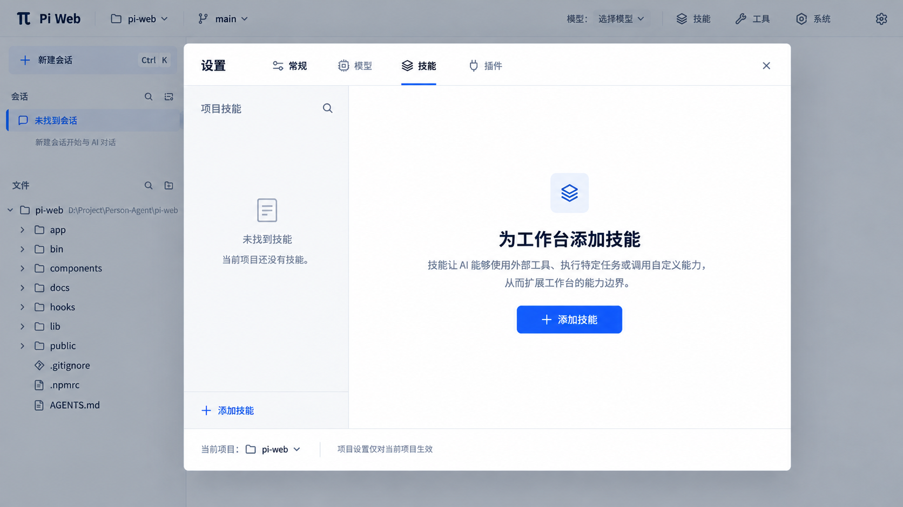 |

## 15 添加技能搜索

搜索来源 skills.sh；全局/项目范围与实际目标一致。

| 原界面 | 设计图 |
|---|---|
|  | 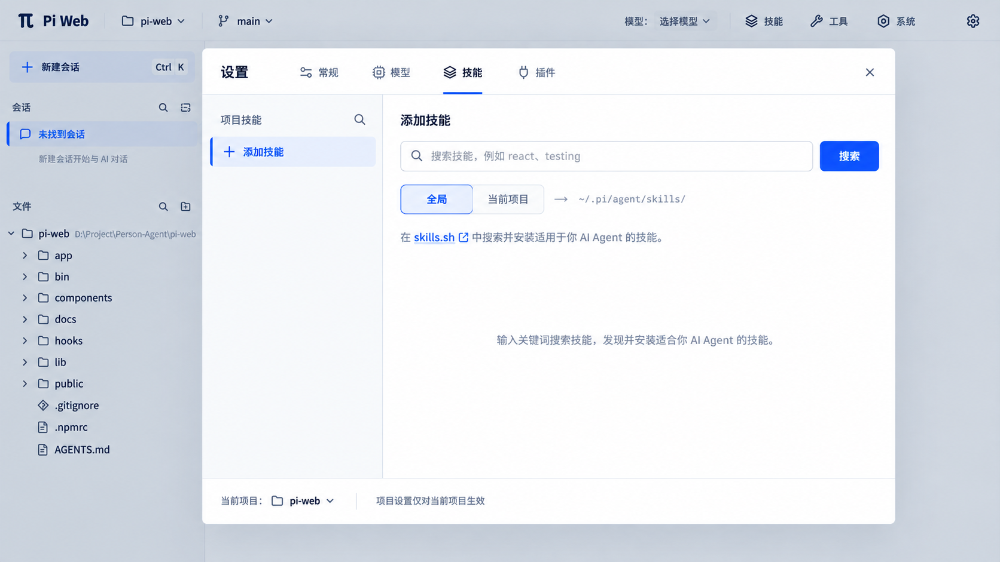 |

## 16 插件管理与添加

来源、范围、安装按钮分层；保留更新、移除、启停和资源计数。

| 原界面 | 设计图 |
|---|---|
|  | 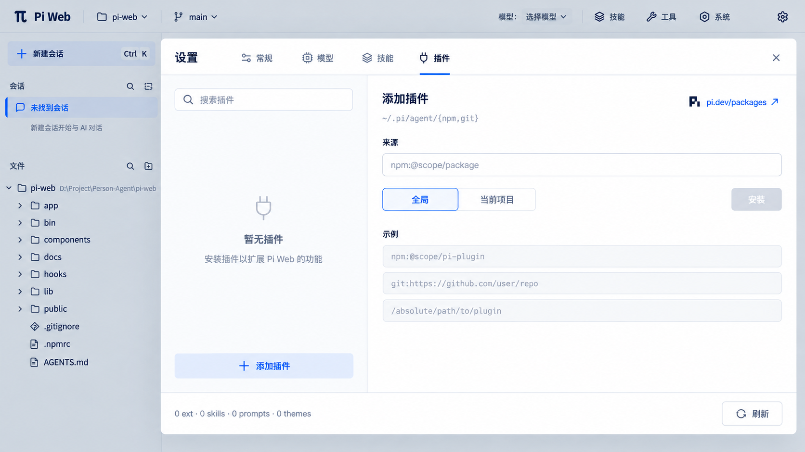 |

## 17 手机设置

手机设置全高；空列表收紧，保留分类选择器。

| 原界面 | 设计图 |
|---|---|
|  | 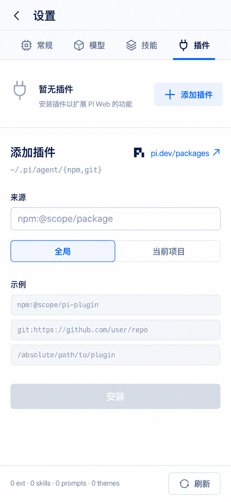 |

## 18 手机文件源码

文件工具栏换行适配；代码区自行滚动。

| 原界面 | 设计图 |
|---|---|
|  | 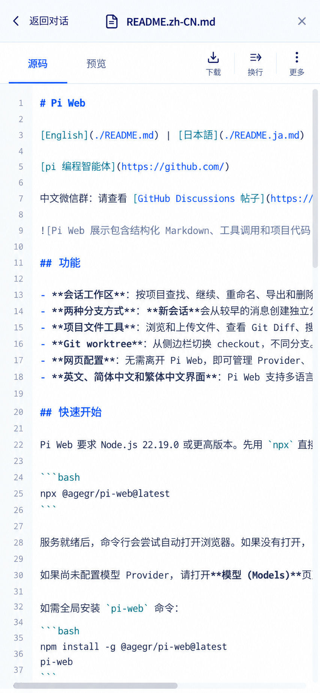 |

## 19 手机聊天

手机输入固定底部；模型与推理可见，次级操作可发现。

| 原界面 | 设计图 |
|---|---|
|  |  |

## 20 手机顶部更多菜单

顶部菜单保留真实操作和禁用条件；不写假版本或快捷键。

| 原界面 | 设计图 |
|---|---|
|  | 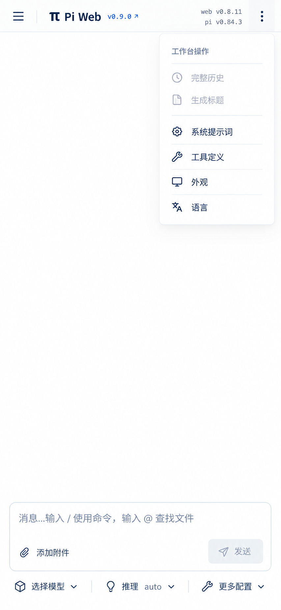 |
